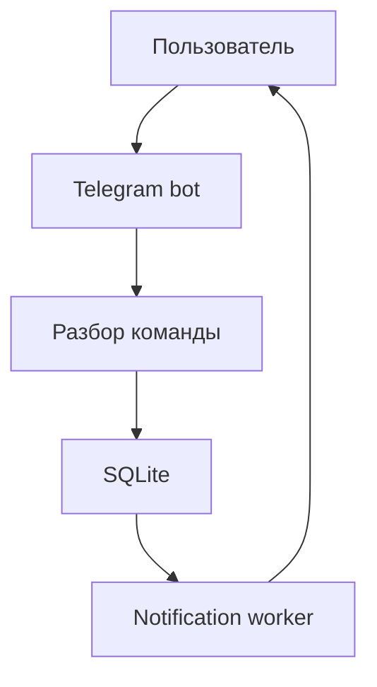

# RemindMe — техническое задание

## Обзор

**RemindMe** — персональный ассистент в Telegram, который помогает управлять напоминаниями, заметками и списками дел.

Бот позволяет:

- создавать напоминания с датой и временем;
- получать уведомления в нужный момент;
- сохранять короткие заметки;
- вести список задач;
- отмечать задачи выполненными;
- просматривать и удалять свои записи.

Основная идея:

> Заменить ежедневные напоминания и стикеры одним интерфейсом в Telegram, который всегда под рукой.

Пользователь может создавать напоминания как обычной фразой, так и Telegram-командой:

```text
напомни мне через 15 минут проверить духовку
напомни завтра в 09:00 позвонить врачу
/remind 25.06.2026 в 18:00 | Купить продукты
/note Пароль от гостевого Wi-Fi лежит в роутере
/todo 2026-06-26 17:00 | Подготовить отчёт
```

В MVP не используются LLM и другие платные внешние сервисы. Фразы разбираются детерминированным Python-парсером по явно заданной грамматике. Бот не пытается угадывать смысл неподдерживаемых или неоднозначных фраз.

---

## Цель

Создать минимального, но полезного Telegram-ассистента, который:

1. Принимает напоминания на русском языке по поддерживаемым шаблонам, а заметки и задачи — через Telegram-команды.
2. Надёжно сохраняет данные между перезапусками.
3. Вовремя отправляет одноразовые уведомления.
4. Позволяет управлять записями без отдельного сайта или приложения.

---

## Термины

| Сущность | Назначение | Обязательные данные |
|---|---|---|
| Напоминание | Одноразовое уведомление в заданный момент | Текст, дата и время |
| Заметка | Информация без статуса и срока | Текст |
| Задача | Дело, которое можно завершить | Текст; срок необязателен |

Напоминание после успешной отправки становится отправленным. Задача не создаёт уведомление, даже если у неё указан срок. Срок задачи используется только для отображения и сортировки.

---

## Порядок реализации

Чтобы проект оставался подъёмным для воркшопа, MVP реализуется последовательно:

1. **Основа:** конфигурация, подключение Telegram, таблица пользователей, миграции и `/start`.
2. **Главный сценарий:** парсер времени, создание, просмотр, удаление и отправка напоминаний.
3. **Надёжность:** повторные попытки, восстановление после перезапуска, часовые пояса и обработка ошибок.
4. **Дополнительные сущности:** заметки и задачи с просмотром и inline-действиями.
5. **Завершение:** тесты, Docker Compose, документация запуска и проверка критериев приёмки.

Этапы не меняют состав MVP: готовым проект считается только после выполнения всех пяти этапов. Если время воркшопа ограничено, демонстрируемым вертикальным срезом должны стать этапы 1–3, поскольку именно напоминания решают основную пользовательскую задачу.

---

## Основные пользовательские сценарии

### Создание напоминания

1. Пользователь отправляет фразу `напомни ...` либо команду `/remind` со временем и текстом.
2. Бот выделяет выражение времени по поддерживаемому шаблону и проверяет текст.
3. Бот вычисляет точный момент с учётом часового пояса пользователя и проверяет, что он находится в будущем.
4. Бот сохраняет напоминание в SQLite в UTC.
5. Бот подтверждает создание и показывает локальные дату и время.
6. В нужный момент бот отправляет уведомление.

Если пользователь отправил сообщение или команду без предварительного `/start`, бот автоматически создаёт его запись с часовым поясом `DEFAULT_TIMEZONE`, а затем обрабатывает запрос.

Пример:

```text
Пользователь: напомни мне через 15 минут проверить духовку

Бот:
Напоминание создано
проверить духовку
24.06.2026 в 12:15 (Europe/Moscow)
```

### Создание заметки

1. Пользователь отправляет команду `/note` и текст.
2. Бот проверяет текст и сохраняет заметку.
3. Бот подтверждает создание.

### Создание задачи

1. Пользователь отправляет команду `/todo` с текстом и необязательным сроком.
2. Бот разбирает аргументы команды.
3. Бот сохраняет активную задачу.
4. Пользователь позже отмечает её выполненной inline-кнопкой.

### Просмотр и управление

1. Пользователь вызывает команду списка.
2. Бот показывает не более 20 записей.
3. Рядом с каждой записью доступны только подходящие ей действия.
4. Бот проверяет принадлежность записи пользователю перед изменением.
5. После действия бот обновляет сообщение со списком.

---

## Команды Telegram-бота

### Общие команды

| Команда | Поведение |
|---|---|
| `/start` | Регистрирует пользователя и показывает краткую инструкцию |
| `/help` | Показывает команды и примеры их использования |
| `/timezone <IANA zone>` | Изменяет часовой пояс пользователя |

### Создание записей

| Команда | Формат | Пример |
|---|---|---|
| `/remind` | `/remind <когда> \| <текст>` | `/remind через 2 часа \| Выключить полив` |
| `/note` | `/note текст` | `/note Код домофона 1234` |
| `/todo` | `/todo текст` или `/todo ГГГГ-ММ-ДД ЧЧ:ММ \| текст` | `/todo 2026-06-25 18:00 \| Подготовить отчёт` |

`/remind` и срок `/todo` используют локальное время пользователя. В команде `/remind` разделитель между выражением времени и текстом — символ `|`; пробелы вокруг него необязательны. В обычной фразе `напомни ...` разделитель не требуется: парсер забирает временное выражение фиксированного формата, а оставшуюся часть считает текстом.

Если формат команды неверен, запись не создаётся. Бот показывает поддерживаемые варианты и один пример. В `/remind` разделителем считается первое вхождение `|`. В `/todo` символ `|` считается разделителем срока только тогда, когда текст слева от него точно соответствует формату даты и времени; иначе весь аргумент сохраняется как текст задачи без срока.

### Фразы для создания напоминаний

Поддерживаются регистронезависимые префиксы `напомни` и `напомни мне`. Между словами допускается любое количество пробелов. В начале и конце сообщения пробелы игнорируются.

| Выражение времени | Пример сообщения | Как вычисляется время |
|---|---|---|
| `через N минуту/минуты/минут` | `напомни через 15 минут проверить духовку` | Текущий момент + N минут |
| `через N час/часа/часов` | `напомни мне через 2 часа выключить полив` | Текущий момент + N часов |
| `через N день/дня/дней` | `напомни через 3 дня оплатить интернет` | Текущий момент + N × 24 часа |
| `сегодня в ЧЧ:ММ` | `напомни сегодня в 19:30 позвонить маме` | Сегодня в локальном часовом поясе |
| `завтра в ЧЧ:ММ` | `напомни завтра в 09:00 отправить отчёт` | Завтра в локальном часовом поясе |
| `завтра` | `напомни завтра купить молоко` | Завтра во время `DEFAULT_REMINDER_TIME` |
| `ДД.ММ.ГГГГ в ЧЧ:ММ` | `напомни 30.06.2026 в 18:00 продлить подписку` | Указанные локальные дата и время |
| `ГГГГ-ММ-ДД ЧЧ:ММ` | `/remind 2026-06-30 18:00 \| Продлить подписку` | Указанные локальные дата и время |

`N` — положительное целое число. Вычисленный момент должен находиться не дальше 365 дней от текущего времени. Слова должны иметь одну из перечисленных форм, но согласование числа и формы слова не проверяется: фраза `через 2 часов` принимается как два часа.

В обычной фразе после временного выражения должен оставаться непустой текст. Символ `|` после выражения допускается и удаляется вместе с пробелами. Например, обе фразы равнозначны:

```text
напомни через 30 минут сделать перерыв
напомни через 30 минут | сделать перерыв
```

Фразы `через полчаса`, `вечером`, `на следующей неделе`, `в пятницу`, `послезавтра`, `через месяц` и свободная перестановка слов не поддерживаются. Бот сообщает об этом и показывает допустимые шаблоны.

### Просмотр записей

| Команда | Результат |
|---|---|
| `/reminders` | До 20 ближайших активных напоминаний по возрастанию времени |
| `/notes` | До 20 последних заметок по убыванию времени создания |
| `/todos` | До 20 активных задач: сначала со сроком, затем без срока |
| `/completed` | До 20 последних выполненных задач |

Неизвестная команда получает ответ:

```text
Неизвестная команда. Используйте /help, чтобы посмотреть доступные действия.
```

---

## Inline-кнопки

| Список | Кнопки |
|---|---|
| Активные напоминания | `Удалить` |
| Заметки | `Удалить` |
| Активные задачи | `Выполнено`, `Удалить` |
| Выполненные задачи | `Удалить` |

Формат `callback_data`:

```text
<action>:<entity>:<id>
```

Примеры:

```text
complete:todo:42
delete:reminder:15
delete:note:7
```

Перед выполнением операции бот проверяет, что запись с указанным `id` принадлежит Telegram-пользователю, нажавшему кнопку. Повторное нажатие на устаревшую кнопку возвращает: `Запись уже изменена или удалена.`

---

## Часовые пояса и время

- Часовой пояс нового пользователя задаётся переменной `DEFAULT_TIMEZONE`.
- Значение должно быть именем из базы IANA, например `Europe/Moscow` или `Europe/Moscow`.
- Команда `/timezone Europe/Moscow` проверяется через стандартный модуль `zoneinfo`.
- Абсолютная дата принимается в форматах `ДД.ММ.ГГГГ в ЧЧ:ММ` и `ГГГГ-ММ-ДД ЧЧ:ММ`.
- Поддерживаются относительные выражения `через N минут/часов/дней`, `сегодня в ЧЧ:ММ` и `завтра [в ЧЧ:ММ]`.
- Если во фразе `завтра` не указано время, используется `DEFAULT_REMINDER_TIME`.
- Для напоминания обязательны и дата, и время.
- Для задачи срок необязателен, но при его наличии обязательны и дата, и время.
- В базе даты и время хранятся в UTC в формате ISO 8601.
- Пользователю даты показываются в его текущем часовом поясе.
- Изменение часового пояса не изменяет момент уже созданного напоминания, но меняет его отображение.
- Переходы на летнее и зимнее время обрабатываются библиотекой `zoneinfo`.
- Несуществующее или неоднозначное локальное время в момент перевода часов отклоняется с просьбой указать другое время.
- `через N дней` означает ровно `N × 24` часа от текущего момента. Поэтому при переходе на летнее или зимнее время отображаемый локальный час может измениться.
- Текущее время для разбора одного сообщения фиксируется один раз, чтобы вычисление и проверка границ использовали один и тот же момент.

---

## Разбор команд

Команды разбираются без внешних сервисов.

### Алгоритм напоминания

1. Нормализовать пробелы по краям, но не изменять текст самой записи.
2. Определить режим: команда `/remind` либо обычная фраза с префиксом `напомни [мне]`.
3. Для `/remind` разделить аргументы по первому `|`; для фразы последовательно проверить шаблоны от наиболее конкретного к общему.
4. Преобразовать выражение времени в aware `datetime`.
5. Очистить текст от разделителя и пробелов по краям, проверить длину.
6. Проверить, что момент позже текущего времени и не дальше 365 дней.
7. Преобразовать время в UTC и сохранить запись.

Функция разбора времени является отдельным модулем без зависимостей от Telegram и БД. Она получает строку, aware `now`, часовой пояс и `DEFAULT_REMINDER_TIME`, а возвращает точный UTC-момент либо типизированную ошибку. Один и тот же парсер используется для `/remind` и обычной фразы.

Приоритет шаблонов для обычной фразы:

1. `через <N> <единица>`;
2. `сегодня в <ЧЧ:ММ>`;
3. `завтра в <ЧЧ:ММ>`;
4. `завтра`;
5. `<ДД.ММ.ГГГГ> в <ЧЧ:ММ>`.

Рекомендуемые регулярные выражения без префикса `напомни [мне]`:

```regex
^через\s+(\d+)\s+(минуту|минуты|минут|час|часа|часов|день|дня|дней)(?:\s*\|\s*|\s+)(.+)$
^сегодня\s+в\s+([01]\d|2[0-3]):([0-5]\d)(?:\s*\|\s*|\s+)(.+)$
^завтра\s+в\s+([01]\d|2[0-3]):([0-5]\d)(?:\s*\|\s*|\s+)(.+)$
^завтра(?:\s*\|\s*|\s+)(.+)$
^(\d{2}\.\d{2}\.\d{4})\s+в\s+([01]\d|2[0-3]):([0-5]\d)(?:\s*\|\s*|\s+)(.+)$
```

Регулярные выражения компилируются с `re.IGNORECASE`. Календарная дата дополнительно проверяется через `datetime.strptime`, поэтому `31.02.2026` не принимается.

### `/note`

Весь текст после имени команды является заметкой. После удаления пробелов он должен содержать от 1 до 500 символов.

### `/todo`

- если до первого символа `|` находится дата в формате `ГГГГ-ММ-ДД ЧЧ:ММ`, левая часть считается сроком, а правая — текстом задачи;
- в остальных случаях весь текст после команды считается задачей без срока;
- срок задачи может быть в прошлом: такая задача отображается как просроченная, но уведомление по ней не отправляется.

Обычный текст, который не начинается с `напомни` и не содержит поддерживаемой команды, не создаёт запись. Бот отвечает:

```text
Напишите «напомни через 15 минут сделать перерыв» или используйте /help.
```

---

## Ограничения входных данных

- Максимальная длина сообщения с командой — 1 000 символов.
- Максимальная длина текста одной записи — 500 символов.
- Пустые сообщения и текст из одних пробельных символов не принимаются.
- Регистр и внутренние пробелы текста записи сохраняются; удаляются только пробелы по краям.
- Изображения, документы, аудио, видео, контакты и геолокация не поддерживаются.
- Ссылки могут храниться как часть текста, но бот не открывает и не анализирует их содержимое.
- Язык интерфейса MVP — русский.
- Бот обрабатывает команды только в личных чатах. В группах он отвечает, что режим не поддерживается, и не сохраняет данные.

Для неподдерживаемого типа сообщения:

```text
Сейчас я принимаю только текстовые сообщения.
```

---

## Отправка уведомлений

Уведомления отправляет фоновый асинхронный worker в том же процессе, что и Telegram-бот.

Алгоритм:

1. Каждые 5 секунд worker ищет напоминания со статусом `scheduled`, у которых `next_attempt_at_utc <= текущее время`.
2. В транзакции запись переводится в `sending`, а `locked_at_utc` получает текущее время.
3. Worker отправляет сообщение через Telegram Bot API.
4. После успешной отправки статус меняется на `sent`, заполняется `sent_at_utc`.
5. После ошибки увеличивается `attempt_count` и назначается следующая попытка.

При создании напоминания устанавливаются `status = scheduled`, `attempt_count = 0` и `next_attempt_at_utc = remind_at_utc`.

Текст уведомления:

```text
Напоминание
Купить продукты
```

Повторные попытки выполняются через 30, 120 и 600 секунд. После четвёртой неуспешной отправки напоминание получает статус `failed`.

При запуске приложения записи в статусе `sending`, заблокированные более 60 секунд назад, возвращаются в `scheduled`. Просроченные активные напоминания отправляются сразу, независимо от длительности простоя.

MVP запускается в одном экземпляре. Доставка имеет семантику at least once: при аварийном завершении между отправкой сообщения и фиксацией статуса возможно повторное уведомление.

---

## База данных

Используется SQLite. Файл по умолчанию: `data/remindme.db`.

### Таблица `users`

| Поле | Тип | Ограничения |
|---|---|---|
| `telegram_user_id` | INTEGER | PRIMARY KEY |
| `timezone` | TEXT | NOT NULL |
| `created_at_utc` | TEXT | NOT NULL |
| `updated_at_utc` | TEXT | NOT NULL |

### Таблица `reminders`

| Поле | Тип | Ограничения |
|---|---|---|
| `id` | INTEGER | PRIMARY KEY AUTOINCREMENT |
| `user_id` | INTEGER | NOT NULL, FK → `users.telegram_user_id` |
| `text` | TEXT | NOT NULL, длина 1–500 |
| `remind_at_utc` | TEXT | NOT NULL |
| `status` | TEXT | NOT NULL: `scheduled`, `sending`, `sent`, `cancelled`, `failed` |
| `attempt_count` | INTEGER | NOT NULL DEFAULT 0 |
| `next_attempt_at_utc` | TEXT | NOT NULL |
| `locked_at_utc` | TEXT | NULL |
| `created_at_utc` | TEXT | NOT NULL |
| `sent_at_utc` | TEXT | NULL |

Индексы:

```sql
CREATE INDEX idx_reminders_delivery
ON reminders(status, next_attempt_at_utc);

CREATE INDEX idx_reminders_user_time
ON reminders(user_id, remind_at_utc);
```

### Таблица `notes`

| Поле | Тип | Ограничения |
|---|---|---|
| `id` | INTEGER | PRIMARY KEY AUTOINCREMENT |
| `user_id` | INTEGER | NOT NULL, FK → `users.telegram_user_id` |
| `text` | TEXT | NOT NULL, длина 1–500 |
| `created_at_utc` | TEXT | NOT NULL |

Индекс:

```sql
CREATE INDEX idx_notes_user_created
ON notes(user_id, created_at_utc DESC);
```

### Таблица `todos`

| Поле | Тип | Ограничения |
|---|---|---|
| `id` | INTEGER | PRIMARY KEY AUTOINCREMENT |
| `user_id` | INTEGER | NOT NULL, FK → `users.telegram_user_id` |
| `text` | TEXT | NOT NULL, длина 1–500 |
| `due_at_utc` | TEXT | NULL |
| `status` | TEXT | NOT NULL: `active`, `completed` |
| `created_at_utc` | TEXT | NOT NULL |
| `completed_at_utc` | TEXT | NULL |

Индекс:

```sql
CREATE INDEX idx_todos_user_status_due
ON todos(user_id, status, due_at_utc);
```

Удаление заметок и задач выполняется физически. Удаление активного напоминания меняет статус на `cancelled`, чтобы worker не отправил его. Отправленные, отменённые и ошибочные напоминания не показываются в `/reminders`.

Все операции чтения и изменения пользовательских сущностей используют одновременно `id` записи и `user_id` текущего Telegram-пользователя. Поиск только по `id` запрещён даже для callback-обработчиков. Удалить можно напоминание только в статусе `scheduled`; если worker уже перевёл его в `sending`, бот сообщает: `Напоминание уже отправляется и не может быть отменено.`

SQLite запускается с `PRAGMA foreign_keys = ON` и режимом журнала `WAL`. Схема создаётся миграциями Alembic.

---

## Интеграции

### Telegram Bot API

Бот работает через long polling. Для MVP не нужны webhook, домен и публичный HTTP-сервер.

Используемые методы:

- `getUpdates` — получение команд, сообщений и callback-запросов;
- `sendMessage` — ответы и уведомления;
- `editMessageText` — обновление списка после действия;
- `answerCallbackQuery` — подтверждение нажатия inline-кнопки;
- `setMyCommands` — регистрация меню команд.

Для интеграции используется `aiogram 3.x`.
Бот работает только в личных чатах, поэтому для отправки уведомления `telegram_user_id` используется как `chat_id`.

## Конфигурация

Приложение читает `.env` по умолчанию:

```dotenv
TELEGRAM_BOT_TOKEN=<token from BotFather>
DATABASE_URL=sqlite+aiosqlite:///data/remindme.db
DEFAULT_TIMEZONE=Europe/Moscow
DEFAULT_REMINDER_TIME=09:00
REMINDER_POLL_INTERVAL_SECONDS=5
LOG_LEVEL=INFO
```

При отсутствии обязательной переменной, неверном часовом поясе или неверном формате времени приложение завершает запуск с понятной ошибкой. Значения токенов в ошибку и логи не попадают.

---

## Архитектура

```text
src/
├── bot/
│   ├── handlers.py          # команды и текстовые сообщения
│   ├── callbacks.py         # inline-действия
│   ├── keyboards.py         # inline-клавиатуры
│   └── formatter.py         # форматирование ответов
├── db/
│   ├── models.py            # SQLAlchemy-модели
│   ├── repositories.py      # операции с сущностями
│   └── session.py           # подключение к SQLite
├── services/
│   ├── parser.py            # разбор и валидация команд
│   ├── reminders.py         # сценарии напоминаний
│   ├── notes.py             # сценарии заметок
│   └── todos.py             # сценарии задач
├── worker/
│   └── notifications.py     # поиск и отправка уведомлений
├── config.py                # настройки приложения
└── main.py                  # запуск бота и worker

alembic/
tests/
├── unit/
└── integration/
```

Поток создания и отправки напоминания:



---

## Технологический стек

- Python 3.12;
- `aiogram 3.x` — Telegram Bot API;
- `pydantic 2.x` и `pydantic-settings` — схемы и конфигурация;
- `SQLAlchemy 2.x` с async API — работа с БД;
- `aiosqlite` — асинхронный драйвер SQLite;
- `Alembic` — миграции;
- `pytest` и `pytest-asyncio` — тестирование;
- `ruff` — линтинг и форматирование.

---

## Обработка ошибок

| Ситуация | Поведение |
|---|---|
| Формат команды неверен | Запись не создаётся, бот показывает формат и пример |
| Дата не существует | Запись не создаётся, бот просит проверить дату |
| Дата напоминания в прошлом | Запись не создаётся, бот просит указать будущее время |
| Ошибка SQLite | Транзакция откатывается, бот сообщает, что запись не сохранена |
| Ошибка отправки уведомления | Повторы по расписанию 30, 120 и 600 секунд |
| Бот заблокирован пользователем | После четырёх попыток напоминание получает статус `failed` |
| Запись не принадлежит пользователю | Операция отклоняется без раскрытия данных |

Общий текст временной ошибки:

```text
Не удалось выполнить действие. Попробуйте ещё раз немного позже.
```

---

## Безопасность и приватность

- Каждый запрос к данным фильтруется по `telegram_user_id`.
- Telegram-токен хранится только в переменной окружения.
- В логах не сохраняются полный текст записей и токен.
- В логах допустимы идентификатор операции, тип сущности, длительность и код ошибки.
- База данных не публикуется и не коммитится в Git.
- Пользовательские записи не передаются сторонним сервисам, кроме Telegram Bot API, через который приходят сообщения.
- Команда `/start` не предоставляет доступ к данным других пользователей.

---

## Функциональные требования MVP

1. Бот регистрирует пользователя при первом входящем сообщении или `/start`.
2. Бот создаёт напоминания по `/remind` и по фразам поддерживаемой русской грамматики.
3. Бот создаёт заметки и задачи по командам заданного формата.
4. Бот валидирует дату, время, горизонт напоминания и текст до записи в БД.
5. Бот хранит данные в SQLite между перезапусками.
6. Бот отправляет одноразовые уведомления в заданное время.
7. Бот показывает списки активных напоминаний, заметок, активных и выполненных задач.
8. Бот отмечает задачу выполненной.
9. Бот читает, изменяет и удаляет записи только их владельца.
10. Бот поддерживает индивидуальный часовой пояс пользователя.
11. Бот восстанавливает обработку напоминаний после перезапуска.
12. Бот обрабатывает ошибки формата, Telegram и SQLite понятными сообщениями.
13. Бот не сохраняет данные из групповых чатов.

---

## Нефункциональные требования

- MVP работает в одном процессе и одном экземпляре.
- Все сетевые и дисковые операции выполняются асинхронно.
- Уведомление отправляется не позднее 10 секунд после заданного времени при доступных Telegram и БД.
- Бот поддерживает не менее 20 одновременно активных пользователей для учебного запуска.
- Unit-тестами покрываются парсер, работа со временем, formatter и сервисы сущностей.
- Интеграционными тестами покрываются репозитории SQLite и worker уведомлений.
- Приложение запускается локально или через Docker Compose.
- После перезапуска сохранённые записи остаются доступными.

---

## Стратегия тестирования

| Уровень | Что проверяем |
|---|---|
| Unit | Все шаблоны парсера, границы `N`, прошлое и горизонт 365 дней, календарные ошибки, DST, форматирование сообщений |
| Service | Создание сущностей, смену статусов, проверку владельца, сортировку и лимит списков |
| Integration | SQLAlchemy-репозитории на временной SQLite, миграции, блокировку и повторные попытки worker |
| Bot handlers | Маршрутизацию команд и текста, callback-действия, личные и групповые чаты с mock Telegram API |
| End-to-end smoke | Создание короткого напоминания тестовым ботом и получение уведомления после перезапуска приложения |

В тестах времени текущий момент передаётся явно; реальные `sleep` не используются. Telegram Bot API подменяется mock-клиентом, кроме ручного end-to-end smoke-сценария.

Обязательные параметризованные наборы для парсера:

- все формы единиц: `минута/минуты/минут`, `час/часа/часов`, `день/дня/дней`;
- с `мне` и без него, в разном регистре, с `|` и без него;
- `сегодня`, `завтра` с явным временем и `завтра` со временем по умолчанию;
- корректные и некорректные даты, время `00:00` и `23:59`;
- пустой текст, 1, 500 и 501 символ;
- момент в прошлом, ровно `now`, в пределах и за пределами 365 дней.

---

## Критерии приёмки

### Абсолютное время

**Дано:** у пользователя настроен `Europe/Moscow`, текущее время — 23 июня 2026 года, 12:00.  
**Когда:** пользователь отправляет `/remind 2026-06-24 18:00 | Купить продукты`.  
**Тогда:** создаётся напоминание на 24 июня 2026 года, 18:00 по `Europe/Moscow`, а пользователю приходит подтверждение.

### Относительное время

**Дано:** текущее время — 24 июня 2026 года, 12:00:00 UTC.  
**Когда:** пользователь отправляет `напомни мне через 15 минут проверить духовку`.  
**Тогда:** создаётся напоминание на 24 июня 2026 года, 12:15:00 UTC с текстом `проверить духовку`.

### Завтра без времени

**Дано:** у пользователя настроен `Europe/Moscow`, текущее локальное время — 24 июня 2026 года, 20:00, а `DEFAULT_REMINDER_TIME=09:00`.  
**Когда:** пользователь отправляет `напомни завтра купить молоко`.  
**Тогда:** создаётся напоминание на 25 июня 2026 года, 09:00 по `Europe/Moscow`.

### Доставка уведомления

**Дано:** существует активное напоминание, срок которого наступил.  
**Когда:** worker выполняет очередную проверку.  
**Тогда:** пользователь получает текст напоминания, а запись получает статус `sent`.

### Неверный формат напоминания

**Дано:** пользователь отправляет `/remind Купить билеты`.  
**Когда:** бот разбирает команду.  
**Тогда:** запись не создаётся, бот показывает правильный формат и пример.

### Неподдерживаемая свободная фраза

**Дано:** пользователь отправляет `напомни в пятницу вечером позвонить врачу`.  
**Когда:** бот разбирает сообщение.  
**Тогда:** запись не создаётся, бот сообщает о неподдерживаемом формате и показывает допустимые шаблоны.

### Напоминание в прошлом

**Дано:** текущее локальное время — 24 июня 2026 года, 20:00.  
**Когда:** пользователь отправляет `напомни сегодня в 19:00 проверить почту`.  
**Тогда:** запись не создаётся, бот просит указать будущее время.

### Управление задачей

**Дано:** у пользователя есть активная задача.  
**Когда:** пользователь нажимает `Выполнено`.  
**Тогда:** задача получает статус `completed`, время завершения сохраняется, задача исчезает из `/todos` и появляется в `/completed`.

### Изоляция данных

**Дано:** пользователь A сформировал callback с идентификатором записи пользователя B.  
**Когда:** пользователь A отправляет callback.  
**Тогда:** данные не изменяются и не раскрываются.

### Изоляция списков

**Дано:** в базе есть записи пользователей A и B.  
**Когда:** пользователь A вызывает `/reminders`, `/notes`, `/todos` и `/completed`.  
**Тогда:** каждый список содержит только записи пользователя A.

### Восстановление после перезапуска

**Дано:** напоминание было сохранено до остановки приложения.  
**Когда:** приложение запускается снова и время напоминания наступает.  
**Тогда:** worker находит запись в SQLite и отправляет уведомление.

---

## Что не входит в MVP

- повторяющиеся напоминания;
- несколько уведомлений для одной записи;
- совместные списки и передача записей другим пользователям;
- вложения, голосовые сообщения и распознавание речи;
- синхронизация с Google Calendar, Apple Calendar, Jira или Todoist;
- web-интерфейс;
- поиск по заметкам и задачам;
- редактирование существующих записей;
- пагинация списков более 20 элементов;
- автоматическое удаление старых записей;
- горизонтальное масштабирование нескольких экземпляров;
- гарантированная доставка exactly once;
- понимание произвольной естественной речи и использование LLM.

---

## Возможные улучшения после MVP

- повторяющиеся напоминания;
- редактирование записей;
- голосовой ввод;
- полнотекстовый поиск;
- теги и категории;
- ежедневная сводка задач;
- snooze-кнопки `через 10 минут` и `через час`;
- синхронизация с внешними календарями;
- экспорт и удаление всех пользовательских данных;
- распознавание команд в свободной форме через локальную или облачную LLM.
